# AI Network Threat Triage — Real-Time Detection & AI-Powered SOC Triage


---

## Table of Contents

- [Why I Built This](#why-i-built-this)
- [Lab Environment](#lab-environment)
  - [Architecture Overview](#architecture-overview)
  - [Tool Flow](#tool-flow)
- [The Tool — What I Actually Built](#the-tool--what-i-actually-built)
- [The SOC Playbook](#the-soc-playbook)
- [The AI Agent](#the-ai-agent)
- [Attack Detection & Triage](#attack-detection--triage)
  - [ICMP Flood](#icmp-flood)
  - [Port Scan](#port-scan)
  - [SSH Brute Force](#ssh-brute-force)
- [Dashboard Features](#dashboard-features)
- [Detection Summary](#detection-summary)
- [What I Took Away](#what-i-took-away)
- [Challenges & What Went Wrong](#challenges--what-went-wrong)
- [Limitations](#limitations)
- [Future Work](#future-work)
- [Technologies Used](#technologies-used)
- [Setup & Installation](#setup--installation)
- [Author](#author)

---

## Why I Built This

Security tools that just detect threats and stop there always felt incomplete to me. Detection is only half the job — the other half is understanding what happened, how serious it is, and what to do about it. That's the part most student projects skip.

So I decided to build something that does both. A tool that captures live network traffic, automatically identifies the type of attack, and then hands it off to an AI agent trained on a custom SOC playbook to produce a real triage report — risk score, MITRE ATT&CK mapping, recommended actions, escalation decision, executive summary.

The whole thing runs on two VMs in VirtualBox. One machine attacks, the other runs the tool and serves a live dashboard. No cloud, no black-box products — every layer is something I built or configured myself.

---

## Lab Environment

Two VirtualBox VMs connected over a bridged network on the same subnet as the host machine.

| Role | Machine | IP Address |
|------|---------|------------|
| Attacker | Ubuntu VM | `192.168.29.58` |
| Internal Server | Kali Linux VM | `192.168.29.75` |

The Kali Linux VM runs the entire tool stack:
- **tshark** — packet capture on `eth0`
- **Python** — traffic analysis and attack detection
- **Flask** — serves the SOC dashboard on port `5000`
- **Airia AI Agent** — receives alert JSON and returns triage report

### Architecture Overview

Two VMs on a bridged network. The Ubuntu VM generates attack traffic. The Kali VM captures it, analyzes it, and sends structured alerts to the AI agent for triage.

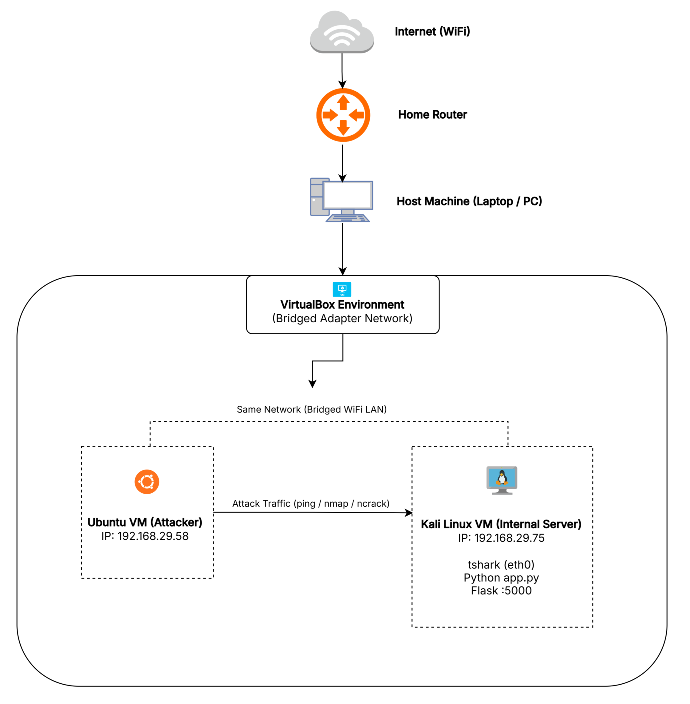

### Tool Flow

Every capture follows the same pipeline — traffic in, decision out.

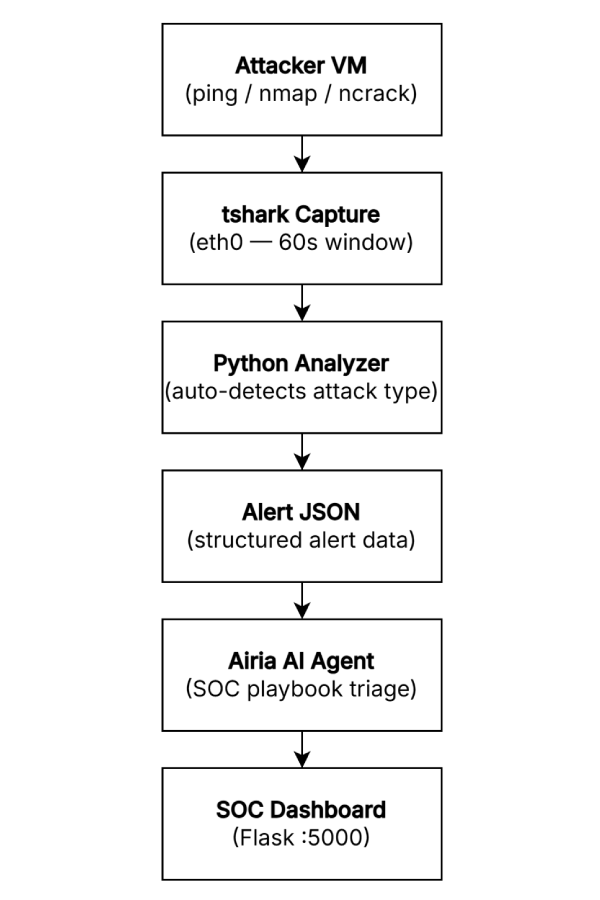

---

## The Tool — What I Actually Built

This isn't a configured product or a tutorial walkthrough. I wrote the entire detection and triage pipeline from scratch.

The tool works in five stages:

**1. Capture** — tshark listens on `eth0` and captures all ICMP and TCP traffic destined for the internal server for a 60-second window. The pcap is written to disk in real time.

**2. Analyze** — a Python script reads the pcap using tshark field extraction, counts packets per source IP, checks for SYN-only TCP patterns across multiple ports, and monitors traffic to port 22. Each check maps to a specific attack type.

**3. Detect** — the analyzer compares results against three thresholds:
- ICMP packets from one source > 40 → ICMP Flood
- Unique TCP ports hit by one source > 15 → Port Scan
- TCP packets to port 22 from one source > 5 → SSH Brute Force

**4. Alert** — if a threshold is crossed, a structured JSON alert is built with all relevant metadata: alert ID, source IP, protocol, packet count, evidence, and the analyst question.

**5. Triage** — the alert JSON is sent to an AI agent via API. The agent follows a custom SOC playbook and returns a complete triage report in structured JSON format.

The dashboard polls the Flask backend every 3 seconds and displays everything live — no refresh needed.

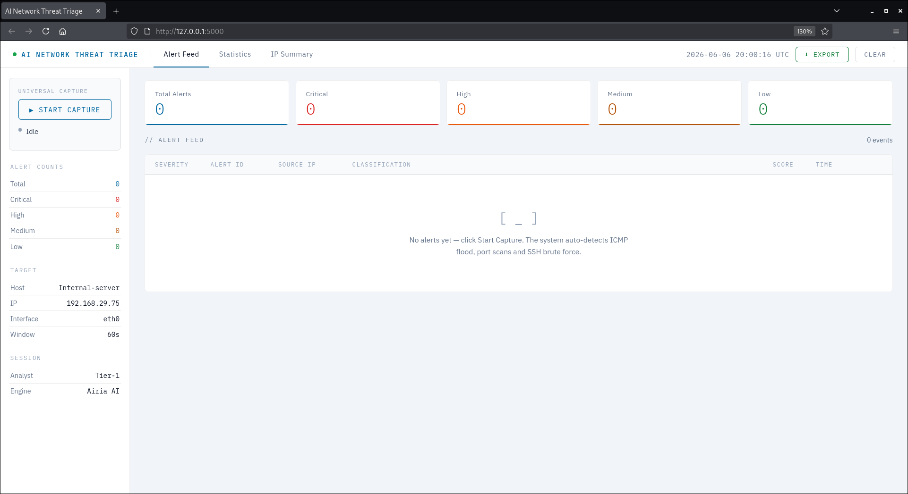

---

## The SOC Playbook

The AI agent doesn't just summarize the alert — it follows a strict set of rules I wrote myself. The playbook (`soc_playbook.md`) defines exactly how every alert must be handled:

- **Section 1** — Input validation: required fields, format checks
- **Section 2** — Threat classification: 6 defined categories
- **Section 3** — Risk scoring: 0–100 model with explicit rules per indicator
- **Section 4** — MITRE ATT&CK mapping: tactic + technique ID + name
- **Section 5** — Action plan: Tier 1 analyst actions matched to risk level
- **Section 6** — Escalation logic: score thresholds determine Tier 1 vs Tier 2
- **Section 7** — Executive summary: plain language, business impact, 2–3 sentences
- **Section 8** — Output format: strict JSON schema, no deviation
- **Section 9** — Confidence level: Low / Medium / High based on data completeness
- **Section 10** — Guardrails: defensive only, no fabrication, no assumed intent

The AI agent never goes beyond what the data actually says. If something is uncertain, it says so.

---

## The AI Agent

The agent is built on Airia and uses GPT-5 Nano as the underlying model. It's published as a pipeline with a single AI model node trained on the SOC playbook as its system instructions.

Every alert JSON from the Python tool is sent to the agent via API. The agent processes it against the playbook and returns a structured triage report. The Flask backend parses the response and stores it in the alert log.

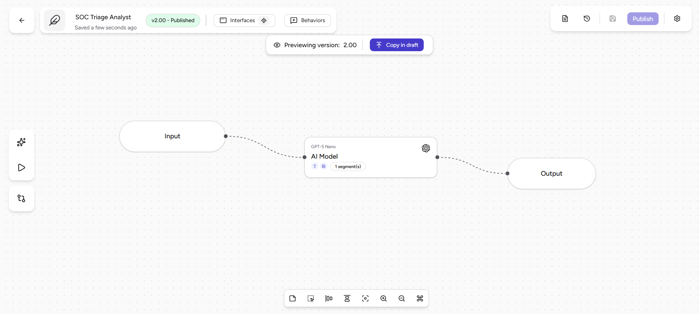

---

## Attack Detection & Triage

### ICMP Flood

An ICMP flood is a denial-of-service attack that overwhelms a target by sending a continuous stream of ping packets. The volume alone is enough to degrade or take down a service.

**Attack command (from Ubuntu VM):**
```bash
ping -f 192.168.29.75
```

The `-f` flag sends packets as fast as possible without waiting for replies — this is flood mode.

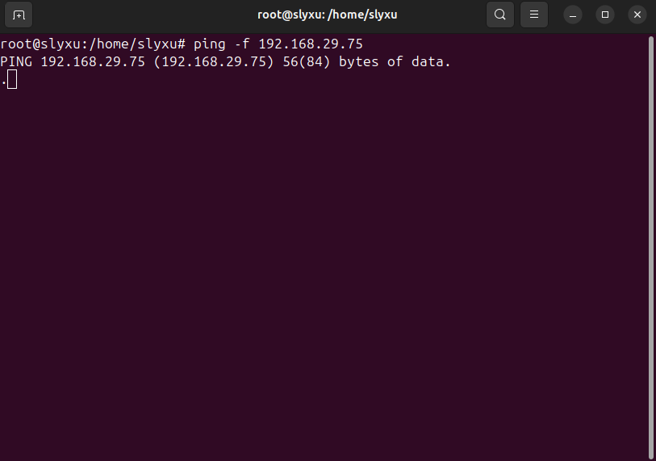

**What the tool captured:**

The dashboard showed the live capture pipeline activate immediately. The packet counter climbed to over 6,000 packets within the 60-second window — all from one source IP.

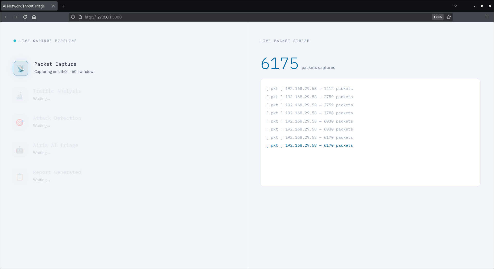

After the capture window closed, the Python analyzer identified the source IP as exceeding the ICMP threshold. The alert was built and sent to the AI agent.

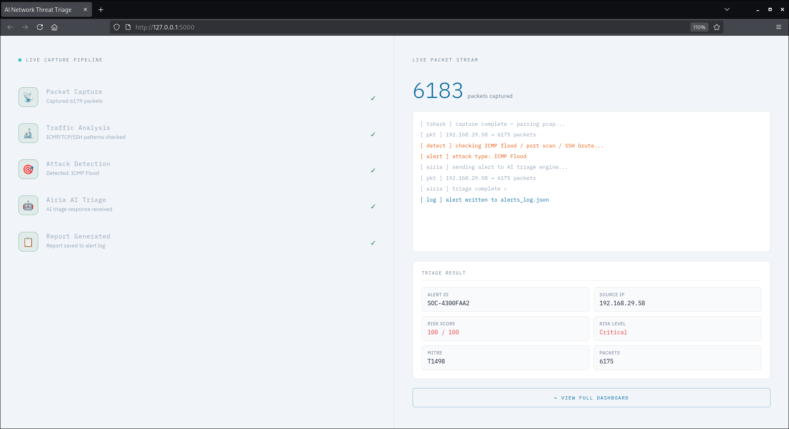

**AI Triage Result:**

The agent scored this at **100/100 — Critical**. It mapped the activity to **T1498 (Network Denial of Service)** under the Impact tactic. Escalation to Tier 2 was recommended immediately, along with IP isolation and rate limiting.

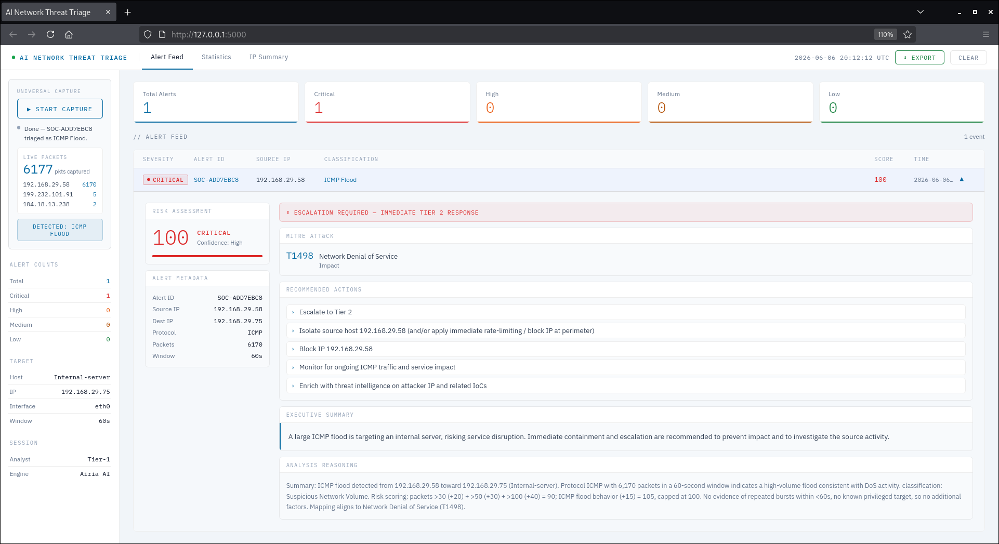

---

### Port Scan

A port scan is a reconnaissance technique — the attacker probes a target to find which ports are open and what services are running. It's typically one of the first steps before an attack.

**Attack command (from Ubuntu VM):**
```bash
nmap -sS 192.168.29.75
```

`-sS` sends TCP SYN packets without completing the handshake — a stealth scan that touches 1000 ports by default.

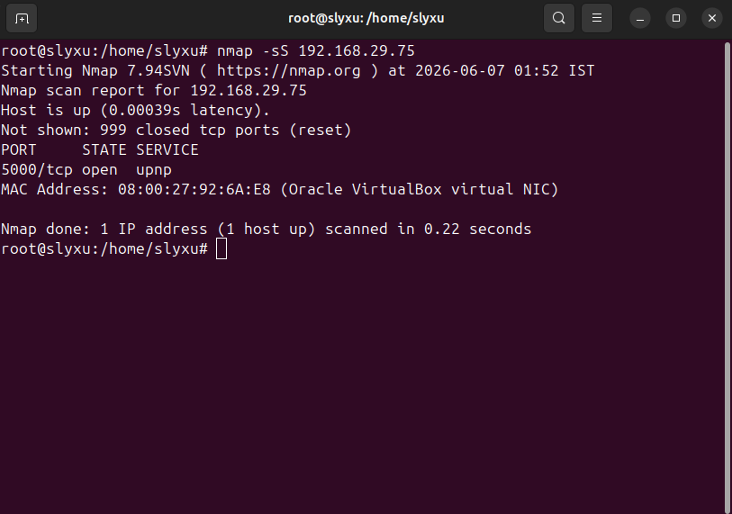

**AI Triage Result:**

The agent scored this at **90/100 — Critical**. It mapped the activity to **T1046 (Network Service Scanning)** under the Discovery tactic. The evidence showed 1000 unique ports probed in a 60-second window from a single source.

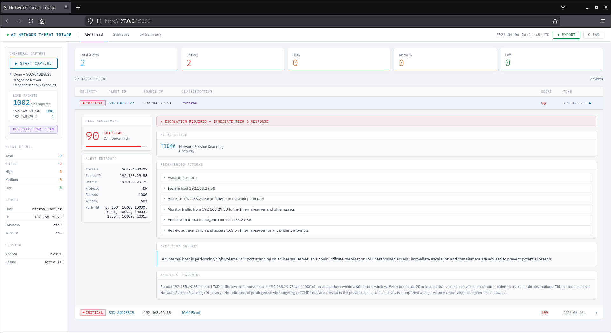

---

### SSH Brute Force

SSH brute force is a credential attack — the attacker tries a large number of username/password combinations against the SSH service hoping to get in.

**Attack command (from Ubuntu VM):**
```bash
ncrack -u root -P /tmp/pass.txt ssh://192.168.29.75
```

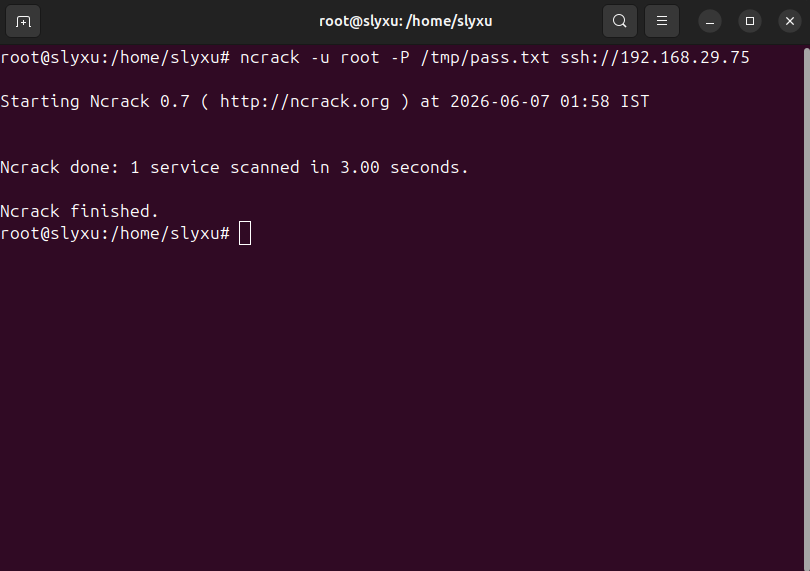

**AI Triage Result:**

The agent scored this at **45/100 — Medium**. It mapped the activity to **T1110 (Brute Force)** under the Credential Access tactic. Recommended actions included reviewing authentication logs, monitoring for repeated attempts, and enriching the source IP with threat intelligence.

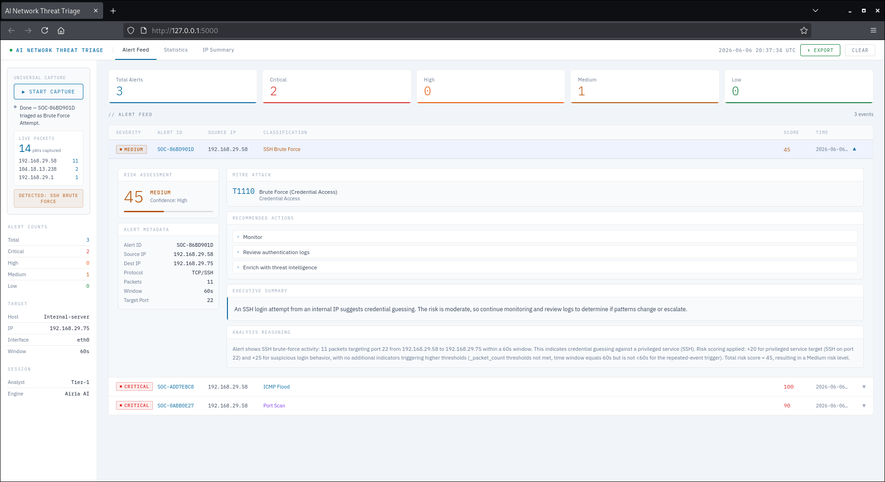

---

## Dashboard Features

The dashboard is a single-page application served by Flask. It polls the backend every 3 seconds and updates without any page refresh.

**Alert Feed** — every detected attack appears as a triage card showing severity badge, source IP, classification, risk score, and timestamp. Clicking a row expands the full triage report inline.

**Live Capture Pipeline** — when a capture is running, a full-screen overlay shows each pipeline stage animating in real time with a live packet counter ticking up on the right side. (images/attacks/icmp-pipeline-done.png)

**Statistics Tab** — bar charts showing alerts by attack type, alerts by risk level, and a daily alert timeline.

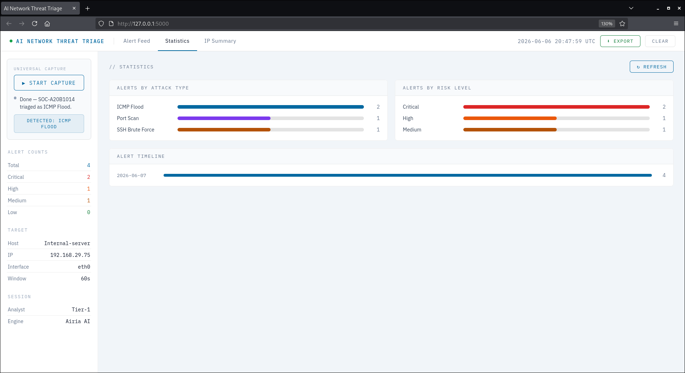

**IP Summary Tab** — a table of all offending source IPs with their classification, risk score, packet count, and last seen timestamp.

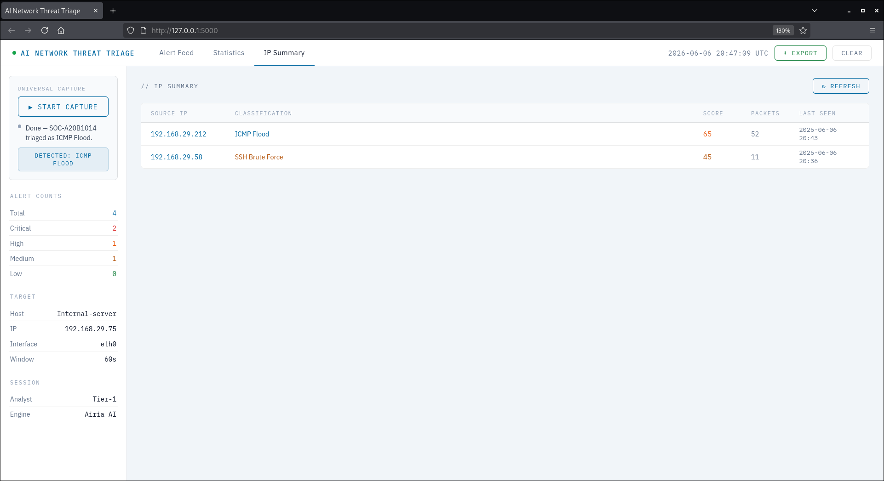

---

## Detection Summary

| Attack | Tool Used | Packets | Risk Score | MITRE | Escalation |
|--------|-----------|---------|------------|-------|------------|
| ICMP Flood | `ping -f` | 6,170 | 100 — Critical | T1498 | Yes — Tier 2 |
| Port Scan | `nmap -sS` | 1,000 | 90 — Critical | T1046 | Yes — Tier 2 |
| SSH Brute Force | `ncrack` | 11 | 45 — Medium | T1110 | No — Monitor |

---

## What I Took Away

- **Detection without triage is incomplete.** Knowing that something happened is only useful if you also know what to do about it. Building the triage layer made the tool actually actionable rather than just an alert generator.

- **Thresholds are a design decision.** Setting the ICMP threshold at 40 packets, port scan at 15 unique ports, SSH at 5 packets — these numbers matter. Too low and you get false positives. Too high and real attacks slip through. There's no universal right answer.

- **The AI is only as good as the playbook.** When I first ran the tool, the agent responses were inconsistent. Once I tightened the playbook — adding strict output format requirements, confidence rules, and guardrails — the quality jumped significantly. The playbook is the real logic.

- **Live feedback changes how you work.** Watching the packet counter tick up in real time while an attack is running makes the threat feel immediate in a way that static logs never do. That visibility is what makes a SOC dashboard useful.

- **Structured alerts matter.** The JSON alert format had to be precise — field names, nesting, required keys. When a field was missing, the AI agent flagged a validation error. That taught me why alert schemas exist in real security systems.

---

## Challenges & What Went Wrong

- **tshark permissions** — the initial capture failed with a permission error because tshark requires root or specific capabilities to access raw network interfaces. Fixed with `sudo` or `setcap` on `dumpcap`.

- **Missing fields in alert JSON** — the SOC playbook requires `source_host` and `protocol` fields that the original script didn't include. The AI agent was returning input validation errors on every alert until I added those fields to the alert builder.

- **Jinja2 conflict** — Flask uses Jinja2 to render templates, and the CSS in the dashboard contained `{#sidebar` which Jinja2 interpreted as a comment tag and threw a `TemplateSyntaxError`. Fixed by serving the HTML file directly with `send_from_directory` instead of `render_template`.

- **Interface mismatch** — the capture was hardcoded to `eth0` but the actual interface name varies between machines. Added a note in the config section to check with `ip a` before running.

- **SSH detection threshold** — ncrack with a small wordlist only generated 11 packets, which barely crossed the threshold of 5. A larger wordlist or repeated runs would push this into High or Critical territory.

---

## Limitations

- Capture window is fixed at 60 seconds — no continuous monitoring mode
- Only detects one attack type per capture run (highest packet count wins)
- SSH detection based on packet volume, not actual failed authentication events
- No persistent storage — alert log resets if the server restarts
- Single interface capture — cannot monitor multiple network segments simultaneously

---

## Future Work

- Add continuous monitoring mode — capture in rolling windows without manual trigger
- Integrate with a real SIEM for centralized log management
- Add DNS-based detection and HTTP flood detection
- Replace Airia with a self-hosted LLM for full offline capability
- Deploy on cloud infrastructure with persistent storage and alerting

---

## Technologies Used

| Tool | Purpose |
|------|---------|
| VirtualBox | Hypervisor — runs both VMs locally |
| Ubuntu VM | Attacker machine — generates attack traffic |
| Kali Linux VM | Internal server — runs the tool |
| Python 3 | Capture pipeline, detection logic, Flask backend |
| tshark | Live packet capture and field extraction |
| Flask | REST API and web server for the dashboard |
| Airia AI | SOC triage agent — processes alerts against the playbook |
| GPT-5 Nano | Underlying model powering the Airia agent |
| HTML / CSS / JS | Single-file dashboard — no frameworks |

---

## Setup & Installation

**1. Clone the repo**
```bash
git clone https://github.com/theomkashyap/ai-network-threat-triage.git
cd ai-network-threat-triage
```

**2. Install dependencies**
```bash
pip install -r requirements.txt
sudo apt install tshark -y
```

**3. Allow tshark without sudo (optional)**
```bash
sudo setcap cap_net_raw,cap_net_admin+eip /usr/bin/dumpcap
```

**4. Configure `app.py`**
```python
INTERFACE      = "eth0"           # check with: ip a
DESTINATION_IP = "YOUR_SERVER_IP" # IP of the machine running the tool
AIRIA_API_URL  = "YOUR_AIRIA_PIPELINE_URL"
AIRIA_API_KEY  = "YOUR_AIRIA_API_KEY"
```

**5. Set up Airia agent**
- Sign up at [airia.ai](https://airia.ai)
- Create a new project and add an AI model node
- Paste the contents of `soc_playbook.md` as the system instructions
- Publish the agent and copy the pipeline URL and API key

**6. Run the tool**
```bash
sudo python3 app.py
```

**7. Open the dashboard**
```
http://<your-server-ip>:5000
```

**8. Generate test traffic (from attacker VM)**
```bash
# ICMP Flood
sudo ping -f <server-ip>

# Port Scan
nmap -sS <server-ip>

# SSH Brute Force
ncrack -u root -P /tmp/pass.txt ssh://<server-ip>
```

---

> **Disclaimer:** This tool is built and tested entirely in an isolated local network environment. All attack simulations are conducted against systems I own and control. Never use these techniques against systems without explicit authorization.

---

## Author

Om Kashyap — [github.com/theomkashyap](https://github.com/theomkashyap)

---

Licensed under the [MIT License](LICENSE).
